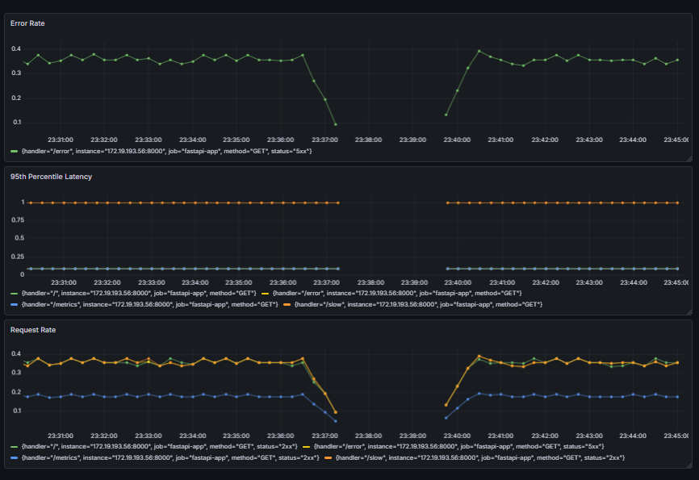
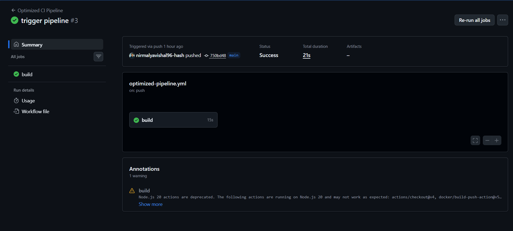
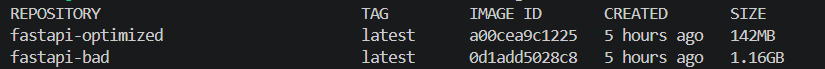
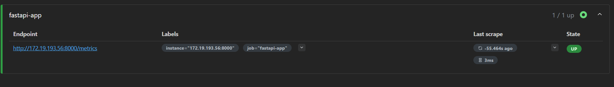

#  DevOps CI/CD Optimization & Monitoring Project

## 📌 Overview

This project demonstrates a **real-world DevOps workflow** by solving common production issues such as slow CI/CD pipelines, large Docker images, and lack of observability.

---

## ❌ Problem Statement

* Docker images were large and inefficient
* CI/CD pipeline builds were slow
* No visibility into application performance
* Difficult to debug failures

---

## ✅ Solution

Implemented an optimized DevOps pipeline with:

* 🐳 Docker optimization (multi-stage, slim image)
* ⚡ CI/CD pipeline with caching (GitHub Actions)
* 📊 Monitoring using Prometheus & Grafana
* 🧪 Failure simulation (`/error`, `/slow` endpoints)

---

## 🏗️ Architecture

```
User → FastAPI App → Prometheus → Grafana Dashboard
                ↓
           CI/CD Pipeline (GitHub Actions)
```

---

## ⚙️ Tech Stack

* FastAPI
* Docker
* GitHub Actions
* Prometheus
* Grafana

---

## 📊 Results (Key Achievements)

| Metric            | Before ❌ | After ✅ |
| ----------------- | -------- | ------- |
| Docker Image Size | 1.16 GB  | 142 MB  |
| Build Time        | ~6 min   | ~1 min  |
| CI/CD Pipeline    | 41 sec   | 15 sec  |

---

## 📸 Screenshots

### 🔹 Grafana Dashboard



### 🔹 CI/CD Pipeline



### 🔹 Docker Optimization



### 🔹 Prometheus Target Status



---

## 🚀 How to Run

### 1. Run App

```
uvicorn app.main:app --host 0.0.0.0 --port 8000
```

### 2. Run Prometheus

```
docker run -d -p 9090:9090 -v $(pwd)/monitoring/prometheus.yml:/etc/prometheus/prometheus.yml prom/prometheus
```

### 3. Run Grafana

```
docker run -d -p 3000:3000 grafana/grafana
```

---

## 📈 Monitoring Metrics

* Request Rate
* Error Rate (5xx)
* Response Latency (P95)

---

## 🧠 Key Learnings

* Docker layer caching optimization
* CI/CD pipeline performance tuning
* Observability using Prometheus & Grafana
* Debugging container networking issues

---

## 🎯 Conclusion

This project demonstrates **end-to-end DevOps practices**, improving system performance, reliability, and observability.

---
